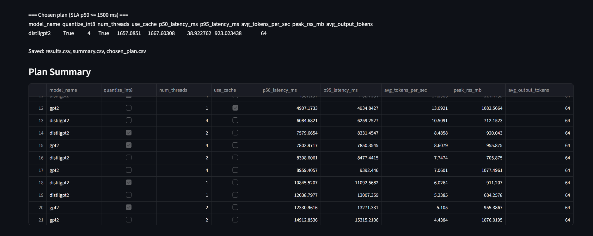
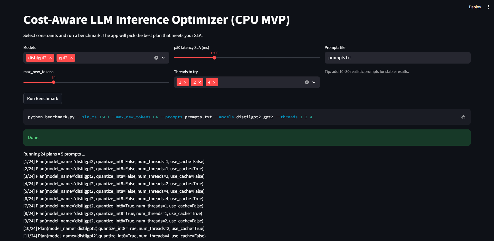

# 🚀 Cost-Aware LLM Inference Optimizer (CPU MVP)

 **Live Demo:**  
https://llm-cost-aware-inference-optimizer-aohn2vtjqdqbhgzskm9ceg.streamlit.app/


##  Overview

Large Language Model (LLM) inference cost is governed by:

- Latency constraints  
- Memory footprint  
- Thread-level parallelism  
- Numeric precision trade-offs  
- KV-cache usage  

This project implements a **cost-aware inference router** that:

1. Benchmarks multiple execution plans  
2. Measures real latency, throughput, and memory  
3. Automatically selects the optimal plan under a given SLA  

All experiments are performed on CPU to simulate constrained hardware environments.


##  Problem Motivation

In production systems, inference must satisfy strict service-level objectives (SLOs):

> “Meet a latency SLA while minimizing resource usage.”

However, LLM inference performance depends on interacting factors:

- Model architecture  
- Precision (INT8 vs FP32)  
- Thread parallelism  
- KV-cache configuration  

This project treats inference as a **search over execution plans** and selects the best configuration under measurable constraints.


## Execution Plan Search Space

Each plan is defined by:

| Dimension       | Options                         |
|----------------|----------------------------------|
| Model          | distilgpt2, gpt2                |
| Quantization   | Dynamic INT8 (CPU) ON / OFF     |
| Threads        | 1, 2, 4                         |
| KV Cache       | use_cache ON / OFF              |

Total plans searched: **24**


## Metrics Measured

For each execution plan:

- p50 latency (ms)  
- p95 latency (ms)  
- Average tokens/sec  
- Peak RSS memory (MB)  
- Output token count  

Plans are ranked by:

1. p50 latency  
2. Peak memory  

Final selection must satisfy:

```
p50_latency ≤ SLA
```

## Example Result (Windows CPU)

**Chosen Plan (SLA = 1500 ms)**

- Model: distilgpt2  
- INT8 Quantization: Enabled  
- Threads: 4  
- KV Cache: Enabled  
- p50 latency: ~1657 ms  
- Throughput: ~39 tokens/sec  
- Peak Memory: ~923 MB  

Dynamic INT8 quantization combined with thread-level parallelism provided the highest throughput under constrained latency.


## Live Demo

The deployed Streamlit app allows users to:

- Set latency SLA  
- Select models and thread configurations  
- Execute full benchmark search  
- Visualize latency, throughput, and memory  
- Automatically select the optimal plan  

👉 Try it here:  
https://llm-cost-aware-inference-optimizer-aohn2vtjqdqbhgzskm9ceg.streamlit.app/


## 🏗 Systems Perspective

This project treats inference as a **systems optimization problem**.

Instead of assuming fixed execution, it:

- Measures real performance  
- Searches over execution space  
- Applies constraint-based selection  
- Balances throughput vs memory vs latency  

This mirrors real-world inference scheduling strategies used in production ML systems.


## 🚀 GPU Extension (Design)

The framework can be extended to GPU-based execution plans by introducing:

- FP16 / BF16 precision modes  
- FlashAttention kernels  
- vLLM backend with paged KV cache  
- GPU memory-aware cost modeling  
- Communication-aware distributed inference  

This enables optimization across:

- Memory bandwidth  
- FLOPs utilization  
- Kernel efficiency  
- KV-cache fragmentation  


## 🛠 Run Locally

```bash
python benchmark.py --sla_ms 1500 --models distilgpt2 gpt2 --threads 1 2 4 --max_new_tokens 64
```

Launch UI:

```bash
streamlit run app.py
```

## 📦 Tech Stack

- PyTorch  
- HuggingFace Transformers  
- Dynamic INT8 Quantization (CPU)  
- psutil for memory tracking  
- Streamlit (deployment)  
- Conda (environment management)  


## 🎯 Why This Project Matters

This is not just benchmarking.

It demonstrates:

- Hardware-aware ML thinking  
- Constraint-based inference optimization  
- Systems-level experimentation  
- End-to-end research → deployment workflow  


## 📸 Application Preview

### 📊 Benchmark Tradeoffs (Latency • Throughput • Memory)

<p align="center">
  
</p>

This visualization shows the full execution search space across 24 plans.  
Plans are ranked by p50 latency and memory footprint.


### 🏆 Automatically Selected Optimal Plan

<p align="center">
  
</p>

The optimizer selects the best configuration satisfying the SLA constraint.


### 📈 Full Plan Summary (Sorted by p50 Latency)

<p align="center">
  
</p>

All execution plans are benchmarked and ranked.


### 🖥 End-to-End Streamlit Interface

<p align="center">
  
</p>

Interactive UI allows dynamic SLA adjustment and execution plan search.


